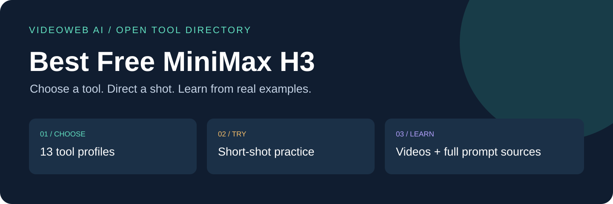

# Kostenlose MiniMax-H3-Tools

[English](./README.md) · [简体中文](./README_zh.md) · [日本語](./README_ja.md) · [한국어](./README_ko.md) · [Español](./README_es.md) · [Français](./README_fr.md) · [Deutsch](./README_de.md) · [Português](./README_pt.md)

Ein Verzeichnis von VideoWeb AI für kostenlose Videotools im Browser. Wählen Sie aus 13 Einträgen, probieren Sie eine kurze Einstellung aus und lernen Sie anhand belegter Beispiele.

**Die Tools sind verbundene Marken desselben Unternehmens. Dies ist keine unabhängige Rangliste; Qualitätsunterschiede wurden nicht gemessen. Seitenprüfung: 2026-09-22. Es wurden keine Videos generiert.**

## 13 kostenlose Tools

| Tool | Einsatz | Genannte Ausgabe | Details |
|---|---|---|---|
| [VideoWeb AI](https://videoweb.ai/free-minimax-h3/) | Tool zur Planung von Eröffnungsszenen, Übergängen und Kamerabewegungen vor der Produktion. | 5s / 480p | [Details](./docs/tools.md#videoweb) |
| [MusicMaker](https://musicmaker.im/free-minimax-h3/) | Plattform für Musikschaffende: animierte Cover, Musikvideo-Szenen und Teaser für neue Veröffentlichungen. Die Clips lassen sich im Schnitt mit eigener Musik verbinden. | 5s / 480p | [Details](./docs/tools.md#musicmaker) |
| [UGC Maker](https://ugcmaker.org/free-minimax-h3/) | Werkzeuge für Produktvorführungen, UGC-Werbeideen und kurze Social-Media-Videos, um Einstiege und Kampagnenkonzepte auszuprobieren. | 5s / 480p | [Details](./docs/tools.md#ugcmaker) |
| [HeyDream](https://heydream.im/free-minimax-h3/) | KI-Kreativsuite für Social-Media-Clips, Produktkonzepte und bewegte Storyboards, steuerbar mit Text sowie Anfangs- und Endbildern. | 5s / 480p | [Details](./docs/tools.md#heydream) |
| [Flaq AI](https://flaq.ai/free-minimax-h3/) | Kostenloses H3-Browsertool auf der Modellplattform flaq.ai zum schnellen Testen von Prompts, Produktenthüllungen und kurzen Szenen mit Ton. | 5s / 480p | [Details](./docs/tools.md#flaq) |
| [BestImage AI](https://bestimage.ai/free-minimax-h3/) | Bild- und Videoplattform für Bildübergänge, Produktbewegungen und Storyboards im Querformat, Hochformat oder Quadrat. | 5s / 480p | [Details](./docs/tools.md#bestimage) |
| [Flyne AI](https://flyne.ai/free-minimax-h3/) | Browser-Videotool für Produktbewegungen und Social-Media-Ideen, gesteuert mit Text oder zwei Anfangs- und Endbildern. | 5s / 480p | [Details](./docs/tools.md#flyne) |
| [SeaImagine](https://seaimagine.com/free-minimax-h3/) | Tool für visuelle Experimente mit surrealen Bewegungen, architektonischer Atmosphäre und grafischen Kompositionen. | 5s / 480p | [Details](./docs/tools.md#seaimagine) |
| [SeeVido](https://seevido.com/free-minimax-h3/) | Kurzvideo-Tool für Figurenreaktionen, Produktszenen und Social-Media-Geschichten. | 5s / 480p | [Details](./docs/tools.md#seevido) |
| [Fylia AI](https://fylia.ai/free-minimax-h3/) | Kreatives Videotool für bewegte Porträts, illustrierte Geschichten und Alltagsszenen. | 5s / 480p | [Details](./docs/tools.md#fylia) |
| [VO4](https://vo4.org/free-minimax-h3/) | Videotool für filmische Bewegung, Ankunftsszenen und erfundene Umgebungen. | 5s / 480p | [Details](./docs/tools.md#vo4) |
| [Chat4o AI](https://chat4o.ai/free-minimax-h3/) | Verwandelt schriftliche Ideen in kurze visuelle Erklärungen, Präsentationsentwürfe und Lernszenen. | 5s / 480p | [Details](./docs/tools.md#chat4o) |
| [AITryOn](https://aitryon.art/free-minimax-h3/) | Mode- und Produktkonzepte. Die Seite beschreibt fünf Sekunden mit Audio aus Text oder Anfangs- und Endbild. | 5s / 480p | [Details](./docs/tools.md#aitryon) |

Gratisbedingungen und Ausgabe wurden auf allen 13 Seiten bestätigt, teils durch Öffnen der FAQ. AITryOn blockierte den HTTP-Client, ließ sich aber im Browser öffnen. Kostenlos, ohne Anmeldung und ohne Mengenlimit sind Seitenangaben; Wartezeit, Wasserzeichen, Verfügbarkeit und aktuelle kommerzielle Bedingungen wurden nicht geprüft.

## Das erste Video

VideoWeb nennt für die kostenlose Seite 5 Sekunden, 480p und 16:9, 9:16 oder 1:1. Für reine Texteingabe lassen Sie beide Bildfelder leer. Für Bildführung laden Sie Anfangs- und Endbild hoch. Beschreiben Sie eine Aktion und eine Kamerabewegung. Nach erforderlicher Verifizierung einmal absenden, Bild und Ton prüfen und brauchbare Clips herunterladen.

[13 kurze Übungen — Englisch und Chinesisch](./docs/free-tool-prompts.md) · [VideoWeb Free H3](https://videoweb.ai/free-minimax-h3/)

## Mit Videos und Prompts lernen

Die X-Galerie enthält 15 Fälle: sechs bestehende und neun zusätzliche. Beiträge und Videometadaten wurden erneut abgerufen. Jeder Fall verlinkt Video, vollständigen Autorenprompt sowie englische und chinesische Hinweise. Frühere Einzelbildbeobachtungen bleiben ihrer Quelle zugeordnet; keine Neugenerierung.

[15 X videos + prompts](./docs/x-community-showcase.md) · [MiniMax official videos](./docs/official-h3-examples.md)

Viele Beispiele nutzen 10–15 Sekunden oder mehrere Referenzen. Daraus folgen keine entsprechenden Funktionen der kostenlosen Formulare. Modell, 2K-Ausgabe und APIs haben eigene Bedingungen.

84 Rezepte, 24 Kategorien und 12 Referenzbilder aus dem Flaq-AI-Repository bleiben mit Quellenangabe erhalten. Neues Banner und Toolkarten sind Navigationsgrafiken, keine Produktaufnahmen oder generierten Ergebnisse.

[84 prompts](./prompts/README.md) · [12 images](./assets/README.md) · [H3](./docs/minimax-h3-overview.md) · [Deployment](./docs/deployment-guide.md) · [Templates](./templates/README.md) · [Multilingual prompts](./docs/multilingual-prompting.md)

## Bei der Pflege helfen

Melden Sie defekte Links oder geänderte Gratisbedingungen und ergänzen Sie eigene Prompts oder belegte Beispiele. Datum und Belege angeben; Seitenprüfung und Generierungstest getrennt halten.

[CONTRIBUTING](./CONTRIBUTING.md) · [Sources](./docs/provenance.md)

## VideoWeb AI Affiliate-Programm

VideoWeb AI bietet Entwicklern und Content-Creatorn ein [Affiliate-Programm](https://videoweb.ai/affiliate-program/). Nach Registrierung und Freigabe können Sie für berechtigte, Ihrem Empfehlungslink korrekt zugeordnete Bestellungen eine Provision erhalten. Das aktuell veröffentlichte Angebot nennt 20 % für die erste gültige Bestellung und 10 % für weitere gültige Bestellungen innerhalb des 60-tägigen Zuordnungsfensters. Berechtigung, Erstattungen, Zuordnung und Auszahlung richten sich nach der geltenden Vereinbarung; Einnahmen werden nicht garantiert. Anmeldung und Offenlegungshinweise stehen im [mehrsprachigen Leitfaden](./docs/affiliate-program.md).

Kostenlose Generierungen allein führen zu keiner Provision aus bezahlten Bestellungen.

[MIT](./LICENSE) © 2026 aivideoweb; Flaq AI
