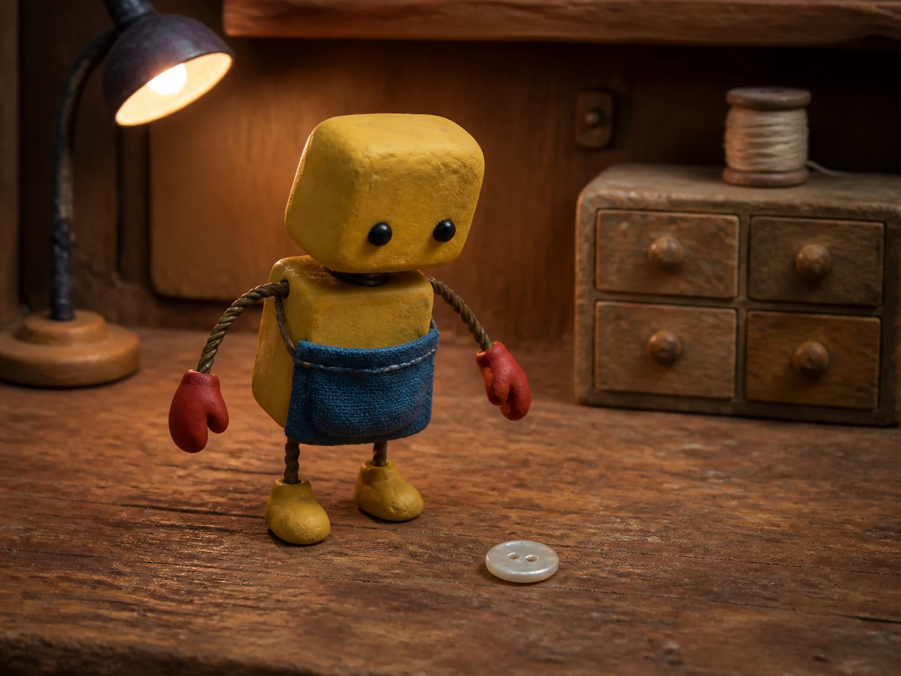

# 免费 MiniMax H3 工具合集


[English](./README.md) · [简体中文](./README_zh.md) · [日本語](./README_ja.md) · [한국어](./README_ko.md) · [Español](./README_es.md) · [Français](./README_fr.md) · [Deutsch](./README_de.md) · [Português](./README_pt.md)

把一个想法变成第一个 **5 秒视频镜头**：从下面六个场景包选题，照着提示词试拍，再把可用片段剪成广告、预告或讲解。由 **[VideoWeb AI](https://videoweb.ai/)** 维护。

[选场景开始](#workflows) · [表单怎么填](#quick-trial) · [查 13 个工具](#免费工具列表) · [完整资料](#更完整的提示词库)

**免费规格：** 13 个工具的页面均标注免注册、5 秒 / 480p（2026-09-22 核对）。以下练习与工具组合供试拍参考，尚未验证实际生成效果。

## 先看 H3 能做什么

先看看 MiniMax 官方演示中的产品广告、3D 动画和音乐视频。点击动图，可查看对应的制作说明。

| 产品广告 | 3D 动画 | 音乐视频 |
|---|---|---|
| [](https://github.com/MiniMax-AI/MiniMax-H3/tree/main/skills/minimalist-product-ad-generator) | [](https://github.com/MiniMax-AI/MiniMax-H3/tree/main/skills/3d-animation-short-generator) | [](https://github.com/MiniMax-AI/MiniMax-H3/tree/main/skills/mv-subtitle-skill-confirmed) |

<a id="首页可复制的短镜头练习"></a>

<a id="workflows"></a>

H3 能生成画面与声音；免费试拍时，先把想法写成 **主体 + 一个动作 + 镜头 + 不变项 + 结束状态 + 声音**。例如，把“高级台灯广告”改成“固定镜头，一次按键，灯亮起，灯具形状不变，最后停住，只留开关声”。你改变的是可检查的画面要求。

## 选一个场景，做出第一个镜头

| 场景 | 默认起点 | 先做什么 |
|---|---|---|
| [电商与创作者广告](#workflow-commerce) | UGC Maker | 商品演示、广告开场 |
| [音乐与新歌预告](#workflow-music) | MusicMaker | 动态封面、音乐预告视觉 |
| [电影感分镜预演](#workflow-storyboard) | VideoWeb AI | 开场、入场、运镜和转场预演 |
| [社交角色故事](#workflow-story) | SeeVido | 角色反应与短剧概念 |
| [教学与演示提案](#workflow-education) | Chat4o AI | 概念插图、教学场景和提案草稿 |
| [视觉艺术与建筑氛围](#workflow-art) | SeaImagine | 超现实场景、建筑氛围和光影试验 |

每包按 **看参考 → 学写法 → 复制试拍 → 检查修改 → 补镜剪辑** 展开。先用主工具完成一个镜头，需要换构图或补镜头时，再尝试辅助工具。同一组视频尽量使用同一入口；切换工具后，重新检查人物、产品和画风是否一致。

<a id="quick-trial"></a>
<a id="第一次怎么用"></a>

### 提示词准备好后，怎么提交

1. 打开所选场景的主工具，复制该场景下方的提示词，选择其中写明的比例。
2. 下面的练习都用纯文字模式，两张图片都留空；配图用于理解构图，不是必须上传的素材。若改用图片引导，须自备匹配的首尾两张图。
3. 完成页面验证后提交一次，等队列状态变化。结果可用时先下载，再检查场景下方列出的重点。
4. 有问题时只改一项，再试；能用的镜头先留下，再决定是否补拍。

[查看表单截图和操作步骤](./docs/first-clip_zh.md)。想比较两种提示词写法，也可以在 [Flaq AI](https://flaq.ai/free-minimax-h3/) 用相同设置分别试拍，记录画面、声音和下载结果；选好工具后可直接开始。

每个场景都有构图参考、可复制的短提示词和创作者视频。参考图用于说明画面构思，创作者视频用于学习镜头方法；它们不是下方免费工具的实测结果。较长视频可拆成多个短镜头练习。 标注“进阶”的示例有额外时长或素材要求，用来学习完整制作思路；免费表单请使用下方 5 秒练习。

<a id="workflow-commerce"></a>

### 电商与创作者广告

商品演示、广告开场；适合电商运营、达人和小商家。


**从参考到自己的镜头：** 茶饮广告可以用星光、水滴和天光变化来展示瓶身质感。第一次试拍只保留“光线扫过瓶身”：保留产品轮廓与文案留白，先做一个能接进广告的产品镜头。 [进阶示例（英文，12–15 秒，多素材）](./prompts/01-brand-advertising.md#brd-001-midnight-observatory-tea-launch)

**主工具：** [UGC Maker](https://ugcmaker.org/free-minimax-h3/) — 先完成一个产品揭示镜头，再考虑人物反应和口播。

**换成你的题材：** 先用下方虚构茶瓶试构图和光线。文字替换适合概念样片；需要保留真实商品外观时，先按参考图指南准备素材。 [商品与角色参考图怎么准备](./docs/product-reference_zh.md)

**复制试拍 · 5 秒 / 480p · 纯文字**

```text
生成一个 5 秒的 16:9 产品镜头。
观测站桌面上，一只修长烟色玻璃茶瓶有深绿色瓶盖和空白浅色标签。
固定中景，只有一条窄光缓慢扫过静止瓶身，最后一秒停留。
瓶身、瓶盖和标签形状不变，上方留出文案空白。
轻微远处风声，不生成文字、对白或额外动作。
```

这段写法可以用来描述你想试拍的商品概念：**茶瓶**是主体，**窄光扫过**是动作，**固定中景**是镜头，**形状不变**是约束，**最后一秒停留**方便接字幕，**远处风声**决定听感。先只替换商品外观，跑通后再换动作。

[用 UGC Maker 试这个镜头](https://ugcmaker.org/free-minimax-h3/)

**看结果，改一处：** 检查瓶身和瓶盖是否变形、光线是否连续、上方是否留下放文案的空间。 把观测站改为空白背景，其他条件先不动；瓶形稳定后再恢复环境。

**有了可用镜头，再往下做：** 先用这一次生成的视频剪出三个段落：开场定格 1 秒、光线动作约 3 秒、结尾定格 2 秒。三段使用同一文件；需要环境开场时再另生成空镜。 [三段时间线、补镜提示词和剪辑步骤](./docs/commerce-three-shots_zh.md)

**按需辅助：** [BestImage AI](https://bestimage.ai/free-minimax-h3/) — 补产品构图试拍；[HeyDream](https://heydream.im/free-minimax-h3/) — 生成一个过渡镜头，随后在剪辑软件拼接

**按需补镜：** [Flyne AI](https://flyne.ai/free-minimax-h3/) — 缺产品揭示镜头时选用；[SeeVido](https://seevido.com/free-minimax-h3/) — 缺人物反应时选用；[AITryOn](https://aitryon.art/free-minimax-h3/) — 服装广告缺布料运动镜头时选用

**看别人如何处理这个问题**

| 耳机广告：从材质微距到结构拆解 | 护肤广告：夜晚到清晨的连续性 | 街头美食：环境、制作与人物反应 |
| --- | --- | --- |
| [](https://x.com/LudovicCreator/status/2082783319075291312/video/1) | [](https://x.com/AIwithJessica/status/2083013658230317082/video/1) | [](https://x.com/nawalsehar/status/2085233880353915217/video/1) |
| **学什么：** 四段时间线连接材质细节、产品旋转、零件分离和重新组装；重点学习几何形状的连续性约束。 | **学什么：** 观察同一人物和产品如何跨越光线、景别与地点变化；对照开头与结尾的产品外观。 | **学什么：** 对比环境全景、制作细节和试吃反应，理解三者不同的叙事作用。 |
| @LudovicCreator · [MP4](https://video.twimg.com/ext_tw_video/2082783299395538944/pu/vid/avc1/1280x720/2lMmYGBjYKPRAZ8M.mp4?tag=12) · [完整提示词](https://x.com/LudovicCreator/status/2082783319075291312) · [解析与 5 秒改写](./docs/x-community-showcase.md#xh3-002) | @AIwithJessica · [MP4](https://video.twimg.com/amplify_video/2083012032279064576/vid/avc1/2560x1440/vfNGJZk54lKChkX4.mp4?tag=29) · [完整提示词](https://x.com/AIwithJessica/status/2083013658230317082) · [解析与 5 秒改写](./docs/x-community-showcase.md#xh3-008) | @nawalsehar · [MP4](https://video.twimg.com/amplify_video/2085233539185061888/vid/avc1/2560x1440/jgQLrvA-NHvBJBx_.mp4?tag=29) · [完整提示词](https://x.com/nawalsehar/status/2085233880353915217) · [解析与 5 秒改写](./docs/x-community-showcase.md#xh3-012) |

**想换题材，可以这样延伸**

| [台灯：一次按键说明功能（英文进阶）](./prompts/03-ugc-lifestyle.md#ugc-001-desk-lamp-honest-first-impression) | [午餐罐：一次开盖展示结构（英文进阶）](./prompts/24-vertical-series-live-creator.md#ver-001-honest-modular-lunch-jar-live-demo) |
| --- | --- |
|  |  |

**继续找同类题材：** [品牌与广告（英文）](./prompts/01-brand-advertising.md) · [产品与电商（英文）](./prompts/02-product-ecommerce.md) · [创作者演示与生活方式（英文）](./prompts/03-ugc-lifestyle.md) · [美食与饮料（英文）](./prompts/05-food-beverage.md) · [时尚与美妆（英文）](./prompts/06-fashion-beauty.md) · [竖屏系列与直播创作（英文）](./prompts/24-vertical-series-live-creator.md)

`电商 · 产品揭示 · 文案留白` · [回到场景选择](#workflows)

<a id="workflow-music"></a>

### 音乐与新歌预告

动态封面、音乐预告视觉；适合音乐人和封面设计师。


**从参考到自己的镜头：** 音箱示例展示了如何用绕拍突出物体的轮廓和材质。制作新歌预告时，可以借用这种运镜：先用一小段平稳绕拍，再由剪辑配上自己的歌曲和标题。 [进阶示例（英文，12 秒，含运镜视频参考）](./prompts/20-multireference-camera-transfer.md#mrf-002-radial-cork-speaker-transfer-motion-grammar-not-content)

**主工具：** [MusicMaker](https://musicmaker.im/free-minimax-h3/) — 先做一段可配歌的预告画面，歌曲节奏在剪辑时控制。

**换成你的题材：** 先试下方虚构音箱，再换成其他封面物件做概念样片。需要准确还原实体或封面设计时，先准备参考图；歌曲留到剪辑时添加。 [商品与角色参考图怎么准备](./docs/product-reference_zh.md)

**复制试拍 · 5 秒 / 480p · 纯文字**

```text
生成一个 5 秒的 1:1 镜头，作为新歌预告视觉。
石墨灰与软木拼接的虚构便携音箱放在干净桌面上。
摄影机围绕静止音箱缓慢移动一个很小的角度，最后一秒停住。
音箱轮廓、按键数量和软木纹理不变，上方留白。
只保留室内环境声，不生成歌曲、歌词或文字。
```

[用 MusicMaker 试这个镜头](https://musicmaker.im/free-minimax-h3/)

**看结果，改一处：** 检查音箱轮廓和材质是否保持不变、绕拍是否平稳；歌名、字幕和节拍在剪辑时检查。 绕拍时音箱变形，就先固定镜头，仅让光线变化；确认轮廓稳定后再加小幅运镜。

**有了可用镜头，再往下做：** 先用这一次生成剪出三段：开场定格 1 秒、小幅绕拍约 3 秒、结尾定格 2 秒；不必重新生成三次。再配自己的歌，调整剪切位置，加入歌名与发布日期。

**按需辅助：** [BestImage AI](https://bestimage.ai/free-minimax-h3/) — 需要不同产品或封面构图时选用；[HeyDream](https://heydream.im/free-minimax-h3/) — 缺连接两段视觉的过渡镜头时选用

**按需补镜：** [SeaImagine](https://seaimagine.com/free-minimax-h3/) — 补空间与光影氛围；[Fylia AI](https://fylia.ai/free-minimax-h3/) — 补插画或人物小动作

**看别人如何处理这个问题**

| 动态文字：让一句话变成视觉叙事 | 西部片头：让剪辑服从节拍 | 动态海报：逐步组装但不破坏版式 |
| --- | --- | --- |
| [](https://x.com/umesh_ai/status/2083909535593644291/video/1) | [](https://x.com/doctorwasif/status/2085599659326935100/video/1) | [](https://x.com/LudovicCreator/status/2083628852165672988/video/1) |
| **学什么：** 为各段文字分配时间、字号变化与转场，最后留出静止阅读时间。 | **学什么：** 学习静止姿态与短动作交替，并让标题落在音乐重拍上。 | **学什么：** 把海报拆成按顺序进入的图层，再留出阅读停顿；保持视觉层级，不让所有区域同时运动。 |
| @umesh_ai · [MP4](https://video.twimg.com/amplify_video/2083909175646785536/vid/avc1/2560x1440/L_Hs2kX2rOJqYZ8F.mp4?tag=29) · [完整提示词](https://x.com/umesh_ai/status/2083909535593644291) · [解析与 5 秒改写](./docs/x-community-showcase.md#xh3-001) | @doctorwasif · [MP4](https://video.twimg.com/amplify_video/2085599599801077760/vid/avc1/1920x1080/aQ8Mx5ImZmjNxrZR.mp4?tag=29) · [完整提示词](https://x.com/doctorwasif/status/2085599659326935100) · [解析与 5 秒改写](./docs/x-community-showcase.md#xh3-007) | @LudovicCreator · [MP4](https://video.twimg.com/ext_tw_video/2083628836285984768/pu/vid/avc1/720x1280/GfseYcSENCN1XmIr.mp4?tag=12) · [完整提示词](https://x.com/LudovicCreator/status/2083628879407632890) · [解析与 5 秒改写](./docs/x-community-showcase.md#xh3-014) |

**想换题材，可以这样延伸**

| [海报：一层进入，其余不动（英文进阶）](./prompts/22-motion-graphics-dynamic-posters.md#mog-001-night-market-poster-builds-on-the-beat) |
| --- |
|  |

**继续找同类题材：** [音乐、表演与声音驱动视频（英文）](./prompts/13-music-performance-audio.md) · [动态图形与动态海报（英文）](./prompts/22-motion-graphics-dynamic-posters.md)

`音乐 · 预告视觉 · 后期配歌` · [回到场景选择](#workflows)

<a id="workflow-storyboard"></a>

### 电影感分镜预演

开场、入场、运镜和转场预演；适合导演、摄影和广告分镜。


**从参考到自己的镜头：** 雨后的运河适合用来交代故事发生的地点。先取“沿岸推进到石桥”这一段：把镜头起点和终点写清楚，比同时要求多种运镜更容易检查空间是否稳定。 [进阶示例（英文，12–15 秒，地点参考图）](./prompts/04-travel-hospitality.md#trv-001-rain-washed-canal-town-morning)

**主工具：** [VideoWeb AI](https://videoweb.ai/free-minimax-h3/) — 默认从 VideoWeb 的单镜头练习起步；VO4 是移动主体镜头的备选，不必两者都用。

**换成你的题材：** 先试下方运河，再把地点换成你的开场环境；始终写明镜头从哪里出发、停在哪里。

**复制试拍 · 5 秒 / 480p · 纯文字**

```text
生成一个 5 秒的 16:9 镜头。
雨后清晨的虚构运河小镇，石桥在前方，一辆自行车静靠岸边。
摄影机保持人眼高度，沿岸缓慢向石桥推进，最后一秒停住。
石桥和岸线不变，自行车不动。轻微水声，不要切镜、对白或文字。
```

[用 VideoWeb AI 试这个镜头](https://videoweb.ai/free-minimax-h3/)

**看结果，改一处：** 检查桥体和岸线是否变形、前进方向是否一致、结尾是否能接下一镜。 桥体弯曲或岸线跳动时，缩短推进距离；先不要再增加骑车人或转弯。

**有了可用镜头，再往下做：** 先把这一镜作为环境分镜。若需要人物入场，另生成一个桥边人物镜头，复用地点、天光、摄影机高度和前进方向；先比较石桥与岸线是否相符，再剪在一起。

**按需辅助：** [BestImage AI](https://bestimage.ai/free-minimax-h3/) — 补构图方案；[HeyDream](https://heydream.im/free-minimax-h3/) — 补分镜之间的过渡镜头

**按需补镜：** [VO4](https://vo4.org/free-minimax-h3/) — 需要跟随移动主体时选用

**看别人如何处理这个问题**

| 悬崖追逐：连续运镜的空间路线 | 游泳片段：区分四种动作 |
| --- | --- |
| [](https://x.com/umesh_ai/status/2082499539735588916/video/1) | [](https://x.com/johnAGI168/status/2082798969499832514/video/1) |
| **学什么：** 观察障碍如何推动重新构图，同时让运动主体持续吸引视线；结尾从追逐转为开阔空间展示。 | **学什么：** 重点研究动作能否看清：检查泳姿切换，以及分配的时间是否足够辨认动作。 |
| @umesh_ai · [MP4](https://video.twimg.com/amplify_video/2082499279680405504/vid/avc1/2560x1440/Zho0yGTsy043Peo5.mp4?tag=29) · [完整提示词](https://x.com/umesh_ai/status/2082499539735588916) · [解析与 5 秒改写](./docs/x-community-showcase.md#xh3-013) | @johnAGI168 · [MP4](https://video.twimg.com/amplify_video/2082798728948125696/vid/avc1/2560x1440/jPepLvnPJuANFMKx.mp4?tag=29) · [完整提示词](https://x.com/johnAGI168/status/2082798969499832514) · [解析与 5 秒改写](./docs/x-community-showcase.md#xh3-010) |

**想换题材，可以这样延伸**

| [攀岩：只留最后一次抓握（英文进阶）](./prompts/09-action-sports.md#act-001-indoor-climbing-final-move) |
| --- |
|  |

**继续找同类题材：** [旅行与酒店（英文）](./prompts/04-travel-hospitality.md) · [电影叙事（英文）](./prompts/07-cinematic-storytelling.md) · [动作与运动（英文）](./prompts/09-action-sports.md) · [汽车与出行（英文）](./prompts/16-automotive-mobility.md) · [视频编辑、续写与本地化（英文）](./prompts/19-editing-continuation-localization.md) · [多参考与运镜迁移（英文）](./prompts/20-multireference-camera-transfer.md)

`分镜 · 运镜 · 首尾帧` · [回到场景选择](#workflows)

<a id="workflow-story"></a>

### 社交角色故事

角色反应与短剧概念；适合社交账号和短片创作者。



**从参考到自己的镜头：** 修理机器人发现、搬起并收好纽扣，就能构成一个小故事。先只拍“听见一声，转头发现”：故事的吸引力来自反应顺序，不必一次塞进完整剧情。 [进阶示例（英文，12 秒，角色与动作参考）](./prompts/08-animation-stylized.md#ani-002-clay-repair-robot-finds-a-button)

**主工具：** [SeeVido](https://seevido.com/free-minimax-h3/) — 先完成一个角色的一次反应；偏插画风格时可改用 Fylia，避免同时换人物和画风。

**换成你的题材：** 先试下方机器人，确定反应和气氛。需要连续使用同一角色时，按参考图指南准备一致的外观素材，再逐镜比较。 [商品与角色参考图怎么准备](./docs/product-reference_zh.md)

**复制试拍 · 5 秒 / 480p · 纯文字**

```text
生成一个 5 秒的 9:16 黏土动画镜头。
木制微缩工作台上，一个芥末黄色方头机器人有黑色珠眼和蓝色工具袋。
听见一次轻微金属声后，它稍微转头看向旁边的珍珠色纽扣，停住。
固定中景，机器人外观和纽扣位置不变，不走路、不说话、不加文字。
```

[用 SeeVido 试这个镜头](https://seevido.com/free-minimax-h3/)

**看结果，改一处：** 脸、服装和手部是否变化，反应顺序是否清楚；对白另行完整听审。 把转头幅度改为“几乎不动，只轻微偏向纽扣”；若仍变形，先试角色静止的一镜，确认外观再加动作。

**有了可用镜头，再往下做：** 先用这一次反应镜头做小故事：开头短暂停留，保留转头动作，再在末帧定格收尾。若需要纽扣落下的开场，另生成只含工作台和纽扣的特写；不要让第二个不一致的机器人混入。

**按需辅助：** [Fylia AI](https://fylia.ai/free-minimax-h3/) — 插画风格的备选起点；[HeyDream](https://heydream.im/free-minimax-h3/) — 需要场景连接时生成过渡镜头

**按需补镜：** [UGC Maker](https://ugcmaker.org/free-minimax-h3/) — 补角色使用产品的动作；[Flyne AI](https://flyne.ai/free-minimax-h3/) — 补单独的产品揭示

**看别人如何处理这个问题**

| 角色登场：从局部揭示到完整轮廓 | 蓝色摄影棚时尚片：三参考同场 | 竹林悬疑：用近景与正反打建立张力 |
| --- | --- | --- |
| [](https://x.com/aimikoda/status/2086412223061135392/video/1) | [](https://x.com/egeberkina/status/2083301476206588086/video/1) | [](https://x.com/sipteaandcoffee/status/2083132770650571041/video/1) |
| **学什么：** 用一个身份参考贯穿局部、身体、表情和全身轮廓的逐步揭示；复现时需要准备角色参考图。 | **学什么：** 提示词为每张参考图指定不同主体，再结合编舞与图形叠加；仅有文字不足以完整复现，还需要身份素材。 | **学什么：** 以色彩、景深、布光和正反打组织戏剧张力；原文限制时代环境，但没有提供带时间点的对白脚本。 |
| @aimikoda · [MP4](https://video.twimg.com/amplify_video/2086412141729402880/vid/avc1/2160x2294/FS1GToZV1NqxgwuP.mp4?tag=29) · [完整提示词](https://x.com/aimikoda/status/2086412223061135392) · [解析与 5 秒改写](./docs/x-community-showcase.md#xh3-003) | @egeberkina · [MP4](https://video.twimg.com/amplify_video/2083300689606852608/vid/avc1/2560x1440/fI84aXKhdEk3Fhp-.mp4?tag=29) · [完整提示词](https://x.com/egeberkina/status/2083301476206588086) · [解析与 5 秒改写](./docs/x-community-showcase.md#xh3-004) | @sipteaandcoffee · [MP4](https://video.twimg.com/amplify_video/2083131917797556224/vid/avc1/2560x1440/IwY2cFJMAMZcOWT2.mp4?tag=29) · [完整提示词](https://x.com/sipteaandcoffee/status/2083132770650571041) · [解析与 5 秒改写](./docs/x-community-showcase.md#xh3-005) |

| 悬疑短片：对白、反应与声音反转 | 日语动画预告：身份与表情控制 |
| --- | --- |
| [](https://x.com/drjoetw/status/2082669221222207488/video/1) | [](https://x.com/haruuraeadss/status/2082945363431080299/video/1) |
| **学什么：** 先制造疑问，再跟随指向动作揭示目标，用反应镜头收束；声音变化承担气氛反转。 | **学什么：** 把人物外观固定项与允许变化的表情、动作分开；镜头变化对应发现线索的时刻。 |
| @drjoetw · [MP4](https://video.twimg.com/amplify_video/2082668962203230208/vid/avc1/2560x1440/PQbFC3v78uE88LdE.mp4?tag=29) · [完整提示词](https://x.com/drjoetw/status/2082669221222207488) · [解析与 5 秒改写](./docs/x-community-showcase.md#xh3-009) | @haruuraeadss · [MP4](https://video.twimg.com/amplify_video/2082945330925240322/vid/avc1/2560x1440/pitGJm9RtfP57PFJ.mp4?tag=29) · [完整提示词](https://x.com/haruuraeadss/status/2082945363431080299) · [解析与 5 秒改写](./docs/x-community-showcase.md#xh3-015) |

**想换题材，可以这样延伸**

| [纸鸟：先听声，再做反应（英文进阶）](./prompts/21-character-dialogue-performance.md#chr-001-paper-birds-plan-for-the-storm) |
| --- |
|  |

**继续找同类题材：** [动画与风格化影像（英文）](./prompts/08-animation-stylized.md) · [转场、喜剧与社交内容（英文）](./prompts/12-transitions-comedy-social.md) · [角色、对白与表演（英文）](./prompts/21-character-dialogue-performance.md)

`社交故事 · 角色反应 · 一致性` · [回到场景选择](#workflows)

<a id="workflow-education"></a>

### 教学与演示提案

概念插图、教学场景和提案草稿；适合教师、产品经理及培训师。


**从参考到自己的镜头：** 用一条轨道串起三个微缩环境，可以引导观众依次观察不同区域。教学试拍先取其中一个展区，让观众看清“我要讲哪个区域”，具体知识再用准确图注和解说补充。 这个镜头只做课程开场，不承担科学解释；事实和因果要由有来源的讲解补充。 [进阶示例（英文，15 秒，多素材）](./prompts/20-multireference-camera-transfer.md#mrf-001-three-biome-museum-rail-in-one-take)

**主工具：** [Chat4o AI](https://chat4o.ai/free-minimax-h3/) — 用文字描述一个可见动作，先判断它是否帮助解释概念；这里使用的是视频入口，不是文本写作服务。

**换成你的题材：** 先试下方展台镜头；换成自己的课程时，一段只呈现一个已核实的讲解要点，图注与解说后期添加。

**复制试拍 · 5 秒 / 480p · 纯文字**

```text
生成一个 5 秒的 16:9 教学概念镜头。
桌面微缩展台分为森林、沙地和湿地区域，一条小轨道贯穿其间。
从能看见完整展台的中景缓慢推进森林区域，最后一秒停留。
所有区域边界、轨道和植物位置固定，不增加物种。
轻微室内环境声，不生成文字、箭头或解说。
```

[用 Chat4o AI 试这个镜头](https://chat4o.ai/free-minimax-h3/)

**看结果，改一处：** 知识是否正确、动作是否容易误解；把非实拍示意标为概念演示。 展区边界变化时改为固定镜头；图注由人添加，不靠生成画面解释未经核实的因果关系。

**有了可用镜头，再往下做：** 用同一条视频的开头交代展台、推进段强调区域、末帧定格叠加准确图注，无需生成三次。再添加有来源的解说，并标明这是微缩概念示意。

**按需辅助：** [BestImage AI](https://bestimage.ai/free-minimax-h3/) — 需要更明确的构图时试拍另一方案；[HeyDream](https://heydream.im/free-minimax-h3/) — 补连接讲解步骤的过渡镜头

**按需补镜：** [VideoWeb AI](https://videoweb.ai/free-minimax-h3/) — 缺空间展示或开场镜头时选用

**看别人如何处理这个问题**

下面游戏界面案例值得借鉴的是：按状态变化逐步讲清过程。将这种写法用于课程时，一段只引出一个讲解步骤。

| 游戏界面：让回合过程清楚可读 |
| --- |
| [](https://x.com/AllaAisling/status/2082909383424446745/video/1) |
| **学什么：** 沿状态变化阅读：发牌、选择、执行、资源更新、对方回合；检查镜头变化时界面是否固定。 |
| @AllaAisling · [MP4](https://video.twimg.com/amplify_video/2082909305062273024/vid/avc1/2560x1440/YHAv0vy5R_uIZnls.mp4?tag=29) · [完整提示词](https://x.com/AllaAisling/status/2082909383424446745) · [解析与 5 秒改写](./docs/x-community-showcase.md#xh3-011) |

**继续找同类题材：** [界面、游戏与数字体验（英文）](./prompts/11-ui-game-digital.md) · [教育、纪录与科学（英文）](./prompts/14-education-documentary-science.md) · [自然、动物与宠物（英文）](./prompts/17-nature-animals-pets.md) · [工业、商业与公共服务（英文）](./prompts/18-industry-business-public-service.md)

`教学 · 概念演示 · 事实检查` · [回到场景选择](#workflows)

<a id="workflow-art"></a>

### 视觉艺术与建筑氛围

超现实场景、建筑氛围和光影试验；适合视觉与概念设计师。


**从参考到自己的镜头：** 让平面地图变成立体景观，能做出有趣的超现实画面。先只让一条等高线抬起：固定纸张边缘和其余线条，才能看清超现实变化究竟有没有按要求发生。 [进阶示例（英文，15 秒，多素材）](./prompts/23-surreal-physics-optical-illusions.md#srl-001-the-map-rises-into-a-landscape)

**主工具：** [SeaImagine](https://seaimagine.com/free-minimax-h3/) — 先让一个局部发生变化，其余画面保持正常，便于判断创意是否成立。

**换成你的题材：** 先试下方虚构地图；改成建筑氛围时，可把抬起的纸脊换成掠过墙面的光影，仍只保留一个变化。

**复制试拍 · 5 秒 / 480p · 纯文字**

```text
生成一个 5 秒的 16:9 超现实镜头。
固定俯拍：档案桌上一张米色纸质等高线地图。
只有中央一条等高线缓慢抬起成低矮纸脊，最后一秒停住。
纸张边缘和其余线条保持平面、位置不变，不裂开、不融化。
轻微纸张摩擦声，不增加文字或人物。
```

[用 SeaImagine 试这个镜头](https://seaimagine.com/free-minimax-h3/)

**看结果，改一处：** 检查纸张边缘和其余线条是否固定、只有指定区域抬起、纸张质感是否连贯。 整张地图融化时，限定只有中央一条线运动，并降低抬起幅度；先固定摄影机。

**有了可用镜头，再往下做：** 用同一条视频保留平面开场、纸脊抬起和结尾停留，先做一支线性短片。需要循环时，后期另做回到平面的过渡；末帧与首帧不同，不能直接假定无缝循环。

**按需辅助：** [BestImage AI](https://bestimage.ai/free-minimax-h3/) — 需要另一构图时试拍；[Fylia AI](https://fylia.ai/free-minimax-h3/) — 需要插画风格时作为备选

**按需补镜：** [VO4](https://vo4.org/free-minimax-h3/) — 补移动主体与跟拍；[HeyDream](https://heydream.im/free-minimax-h3/) — 补连接两个空间的过渡镜头

**看别人如何处理这个问题**

| 日常影像与不可能事件：值得研究的偏差 |
| --- |
| [](https://x.com/cocktailpeanut/status/2086879654116495564/video/1) |
| **学什么：** 通过日常活动铺垫再引出不可能事件，适合研究伏笔、突变，以及模型是否按指定物理事件执行。 |
| @cocktailpeanut · [MP4](https://video.twimg.com/amplify_video/2086878515744669696/vid/avc1/832x480/SWq-SdbO4yoiFzOO.mp4?tag=29) · [完整提示词](https://x.com/cocktailpeanut/status/2086879654116495564) · [解析与 5 秒改写](./docs/x-community-showcase.md#xh3-006) |

**继续找同类题材：** [奇幻、科幻与视觉特效（英文）](./prompts/10-fantasy-scifi-vfx.md) · [建筑、室内与房地产（英文）](./prompts/15-architecture-interiors-real-estate.md) · [超现实物理与视觉错觉（英文）](./prompts/23-surreal-physics-optical-illusions.md)

`视觉艺术 · 建筑 · 光影` · [回到场景选择](#workflows)

<a id="看视频找完整提示词"></a>
<a id="参考图怎么用"></a>
<a id="完整提示词样例观测站茶饮广告"></a>

## 更完整的提示词库

接下来可先读中文导读，了解 **24 个分类、84 条提示词**的用途和素材要求，再选择英文完整示例，或打开案例解析，学习怎样把长时间线缩成一个镜头。

[24 类提示词中文导读](./docs/prompt-library_zh.md) · [84 条完整提示词（英文）](./prompts/README.md) · [15 条案例的详细解析](./docs/x-community-showcase.md) · [13 条独立短练习](./docs/free-tool-prompts.md) · [观测站茶饮进阶示例（英文，12–15 秒）](./prompts/01-brand-advertising.md#brd-001-midnight-observatory-tea-launch) · [参考图制作说明](./assets/minimax-h3-reference-image-prompts.md) · [写法指南（英文）](./docs/prompting-guide.md) · [制作模板（英文）](./templates/README.md) · [多语言示例](./docs/multilingual-prompting.md)

<a id="桌面台灯演示"></a>
[台灯按键练习](./docs/free-tool-prompts.md#ugcmaker)

<a id="动态封面氛围"></a>
[唱片封面光线练习](./docs/free-tool-prompts.md#musicmaker)

<a id="种子传播示意"></a>
[种子传播示意练习](./docs/free-tool-prompts.md#chat4o)

<a id="videoweb-first-prompt"></a>
[房间开场练习](./docs/free-tool-prompts.md#videoweb)

<a id="minimax-h3-是什么能做什么"></a>

## 需要更长片段或更多参考时

五秒试拍可以帮你确定动作和构图。想做更长的剧情、多素材参考或更清晰的成片，再看 H3 的完整工作流；先确定制作需求，再选相应入口。

| 需求 | 模型层面的方式 | 免费工具怎么理解 |
|---|---|---|
| 从想法生成场景 | 文生视频 | 先写一个短动作 |
| 连接两个画面 | 首尾帧生成 | 按免费表单要求上传两张图 |
| 参考身份、动作或声音 | 多素材参考生成 | 不能据此推断免费表单支持上传视频或音频 |
| 更长、更清晰的制作 | 本地模型或托管服务 | 与免费页分开，可能需要付费接口或计算资源 |

官方资料列出 4–15 秒、默认短边 768 像素，以及通过 H3-Regenerate-2K 得到 2K 的流程；H3-Context-IR 与 H3-Regenerate-2K 属于托管组件。**模型能力不等于免费版配额。** 详情见[官方仓库](https://github.com/MiniMax-AI/MiniMax-H3)、[模型说明](https://huggingface.co/MiniMaxAI/MiniMax-H3)、[能力介绍](./docs/minimax-h3-overview.md)、[部署指南](./docs/deployment-guide.md)与[接口流程](./docs/api-workflow.md)。

## 免费工具列表

下面列出 13 个免费 MiniMax H3 工具。选一个适合当前任务的入口，打开对应练习，就可以开始试拍。

| 工具 | 适合先尝试 | 页面可查输出 | 详细介绍与练习 |
|---|---|---|---|
| [VideoWeb AI](https://videoweb.ai/free-minimax-h3/) | 适合开场、转场和运镜试拍。先用一个短镜头看清构图和动作，再决定是否扩展成完整片段。 | 5 秒 / 480p | [介绍](./docs/tools.md#videoweb) · [继续场景练习](#workflow-storyboard) |
| [MusicMaker](https://musicmaker.im/free-minimax-h3/) | 适合动态封面、新歌预告和音乐视频背景。先生成短片，再下载到剪辑软件中与自己的音乐组合。 | 5 秒 / 480p | [介绍](./docs/tools.md#musicmaker) · [继续场景练习](#workflow-music) |
| [UGC Maker](https://ugcmaker.org/free-minimax-h3/) | 适合产品演示和社交短片创意。先测试打开台灯这样的开场动作，再扩写广告脚本。 | 5 秒 / 480p | [介绍](./docs/tools.md#ugcmaker) · [继续场景练习](#workflow-commerce) |
| [HeyDream](https://heydream.im/free-minimax-h3/) | 从文字或首尾两张图片探索场景。适合先确定构图、动作和转场，再制作完整视频。 | 5 秒 / 480p | [介绍](./docs/tools.md#heydream) · [练习](./docs/free-tool-prompts.md#heydream) |
| [Flaq AI](https://flaq.ai/free-minimax-h3/) | 可先用免费网页比较两种提示词写法，再考虑单独的模型接口集成。适合快速验证产品展示和视听场景创意。 | 5 秒 / 480p | [介绍](./docs/tools.md#flaq) · [练习](./docs/free-tool-prompts.md#flaq) |
| [BestImage AI](https://bestimage.ai/free-minimax-h3/) | 适合把产品摆放、设计构图或分镜首尾状态连接起来，也能直接从文字生成场景。 | 5 秒 / 480p | [介绍](./docs/tools.md#bestimage) · [练习](./docs/free-tool-prompts.md#bestimage) |
| [Flyne AI](https://flyne.ai/free-minimax-h3/) | 适合简短的产品运动和图形创意。用文字或首尾图测试一次揭示、移动，再检查构图。 | 5 秒 / 480p | [介绍](./docs/tools.md#flyne) · [练习](./docs/free-tool-prompts.md#flyne) |
| [SeaImagine](https://seaimagine.com/free-minimax-h3/) | 适合想象建筑、超现实构图和空间氛围。用一个克制的动作观察尺度、透视和光影。 | 5 秒 / 480p | [介绍](./docs/tools.md#seaimagine) · [继续场景练习](#workflow-art) |
| [SeeVido](https://seevido.com/free-minimax-h3/) | 适合角色反应和产品短场景。围绕一个可见事件建立小故事，比连续塞入多个转场更容易判断结果。 | 5 秒 / 480p | [介绍](./docs/tools.md#seevido) · [继续场景练习](#workflow-story) |
| [Fylia AI](https://fylia.ai/free-minimax-h3/) | 适合肖像动作、插画场景和生活片段。先用小幅动作或环境变化判断整体风格。 | 5 秒 / 480p | [介绍](./docs/tools.md#fylia) · [练习](./docs/free-tool-prompts.md#fylia) |
| [VO4](https://vo4.org/free-minimax-h3/) | 适合登场镜头、移动摄影和虚构环境。把空间路线说清楚，让镜头有明确起止。 | 5 秒 / 480p | [介绍](./docs/tools.md#vo4) · [练习](./docs/free-tool-prompts.md#vo4) |
| [Chat4o AI](https://chat4o.ai/free-minimax-h3/) | 适合教学场景和演示文稿创意。用一个清楚的动作表达概念，再补充必要文字说明。 | 5 秒 / 480p | [介绍](./docs/tools.md#chat4o) · [继续场景练习](#workflow-education) |
| [AITryOn](https://aitryon.art/free-minimax-h3/) | 适合服装运动、穿搭场景和产品概念。免费 H3 页面可从文字或首尾两张图生成带音频短片，先看运动想法，再考虑完整制作。 | 5 秒 / 480p | [介绍](./docs/tools.md#aitryon) · [练习](./docs/free-tool-prompts.md#aitryon) |


使用前请再看一眼页面上的免费条件和输出设置；排队时间、可用性和规则可能变化。[查看核对记录](./docs/provenance.md)。

## 常见问题

**真的免费吗？** 这 13 个页面均提供免费入口说明。具体额度、排队和可用性以使用时的页面为准；发现变化，欢迎附链接和日期反馈。

**免注册是否就不用验证？** 不是。提交时仍可能要求人工验证，不等于必须注册账号。

**能只上传一张图吗？** 本目录免费页的指引是纯文字或首尾两张图；不能因为模型本身支持单图，就推断免费表单也支持。

**2K、15 秒和接口也免费吗？** 没有这项证据。VideoWeb 免费页是 5 秒、480p；其它入口看各自实际设置和收费说明。

**能商用吗？** 本项目没有确认统一的商用授权。请查看所选平台当前条款，同时确认人物、声音、音乐、商标与输入图片的权利。本仓库的 MIT 许可不覆盖所有外部视频和生成结果。

**画面不稳定怎么办？** 保留一个主体动作和一种运镜，每次只改一个要求。重点检查手部、几何形状、产品标识、场景连续性和声音。

**链接或视频失效怎么办？** 视频直链失效先回原帖；生成排队时不要连续重试。[报告工具或媒体问题](https://github.com/aivideoweb/best-free-minimax-h3/issues/new?template=tool-update.yml)时注明链接、日期和现象。

## 一起维护


欢迎补充新工具、免费规则变化、原创短提示词和有来源的视频案例。先看[贡献指南](./CONTRIBUTING.md)、[维护清单](./docs/maintenance.md)和[来源记录](./docs/provenance.md)。分享试拍结果时，请附工具、日期、提示词、设置和视频，并写清遇到的问题；仅查看页面时也请注明。

## 关于 VideoWeb AI

[VideoWeb AI](https://videoweb.ai/) 提供浏览器内的视频与视觉创作工具。目录中的 13 个工具来自本公司相关品牌，我们按创作场景整理使用建议，欢迎社区补充实际体验。本项目由 VideoWeb AI 维护，不是 MiniMax 官方项目。

## 支持联盟推广合作

欢迎创作者、测评作者、教育者和社区加入 [VideoWeb AI 联盟推广计划](https://videoweb.ai/affiliate-program/)。2026-09-22 查看公开页面时，规则为：推荐用户的首笔有效付费订单佣金 **20%**，注册后 **60 天内**后续有效付费订单佣金 **10%**。单纯免费生成不产生付费订单佣金。

打开计划页面，阅读现行协议并申请，通过后使用分配的推广链接。推广时说明佣金关系，如实描述测试结果。资格、归因、退款和结算以当前协议为准，不保证收益。[申请与披露说明](./docs/affiliate-program.md)。

## 许可与致谢

感谢 [Flaq AI 的开源提示词项目](https://github.com/flaqai/awesome-minimax-h3-video-prompts)提供 84 条提示词和 11 张场景参考图；本项目在此基础上补充了免费工具指南与短镜头练习。仓库采用 [MIT 许可](./LICENSE)，保留 aivideoweb 与 Flaq AI 的版权信息。创作者视频已在案例旁注明作者和原帖，模型权重与外部媒体遵循各自条款。[查看完整来源与核对记录](./docs/provenance.md)。
