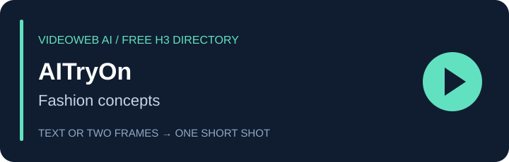

# Free MiniMax H3 tool profiles / 免费工具介绍

[Home](../README.md) · [中文首页](../README_zh.md) · [Comparison evidence](../data/tools.json) · [Five-second practice](./free-tool-prompts.md)

All 13 entries come from the source README’s free-tools section. These are related company brands; the use-case labels help navigation and do not prove different model quality or backends. Descriptions report page positioning and suggest an appropriate first experiment.

所有条目均为本公司相关品牌，按用途帮助选择，不是独立测评排名。页面写“免费”不代表本项目已实际生成成功。13 个页面均读到免费条件和输出规格；部分参数通过浏览器展开问答确认。未知项不补猜测。

## VideoWeb AI

**[Open free H3 tool / 打开免费工具](https://videoweb.ai/free-minimax-h3/)** · Shot planning / 镜头规划

Opening shots, transitions and camera studies for filmmakers and marketers. Use a short take to decide whether the framing communicates the scene before planning a longer sequence.

适合开场、转场和运镜试拍。先用一个短镜头看清构图和动作，再决定是否扩展成完整片段。

- **Page claim / 页面说明:** free, no signup, unlimited generation count; text or both endpoint images. “Unlimited” does not establish queue speed or uptime.
- **Output / 输出:** 5s · 480p.
- **Evidence / 证据:** Public page read; generation not tested / 已读页面，未实际生成; 2026-09-22.
- **Before use / 使用前:** Do not assume the broader model demos use the free form’s settings. 页面中的模型演示不代表免费表单的输出规格。
- **Try / 练习:** [A warm room reveal / 暖色房间开场](./free-tool-prompts.md#videoweb).
- **Not measured / 未测:** watermark, queue wait, actual output quality, current commercial-use terms.

## MusicMaker

**[Open free H3 tool / 打开免费工具](https://musicmaker.im/free-minimax-h3/)** · Music visuals / 音乐视觉

A music-focused platform for cover animation, release teasers and visual backgrounds. Create a short visual, download it, then cut it against your own track in an editor.

适合动态封面、新歌预告和音乐视频背景。先生成短片，再下载到剪辑软件中与自己的音乐组合。

- **Page claim / 页面说明:** free, no signup, unlimited generation count; text or both endpoint images. “Unlimited” does not establish queue speed or uptime.
- **Output / 输出:** 5s · 480p.
- **Evidence / 证据:** Public page read; generation not tested / 已读页面，未实际生成; 2026-09-22.
- **Before use / 使用前:** The free tool does not automatically synchronize clips to your uploaded song. 免费工具不等于上传歌曲后自动卡点或生成完整音乐视频。
- **Try / 练习:** [Cover-art atmosphere / 动态封面氛围](./free-tool-prompts.md#musicmaker).
- **Not measured / 未测:** watermark, queue wait, actual output quality, current commercial-use terms.

## UGC Maker

**[Open free H3 tool / 打开免费工具](https://ugcmaker.org/free-minimax-h3/)** · Creator product demos / 创作者产品演示

A creator-oriented workspace for product demonstrations and short social concepts. Test an opening action, such as turning on a lamp, before developing an ad script.

适合产品演示和社交短片创意。先测试打开台灯这样的开场动作，再扩写广告脚本。

- **Page claim / 页面说明:** free, no signup, unlimited generation count; text or both endpoint images. “Unlimited” does not establish queue speed or uptime.
- **Output / 输出:** 5s · 480p.
- **Evidence / 证据:** Public page read; generation not tested / 已读页面，未实际生成; 2026-09-22.
- **Before use / 使用前:** A generated performance is not a real customer testimonial. 生成的人物表演不能当作真实用户证言。
- **Try / 练习:** [Desk lamp demo / 桌面台灯演示](./free-tool-prompts.md#ugcmaker).
- **Not measured / 未测:** watermark, queue wait, actual output quality, current commercial-use terms.

## HeyDream

**[Open free H3 tool / 打开免费工具](https://heydream.im/free-minimax-h3/)** · Visual storyboards / 动态分镜

A general creative suite for exploring scene ideas from text or a pair of endpoint images. Useful when the next decision is a composition or transition rather than a finished film.

从文字或首尾两张图片探索场景。适合先确定构图、动作和转场，再制作完整视频。

- **Page claim / 页面说明:** free, no signup, unlimited generation count; text or both endpoint images. “Unlimited” does not establish queue speed or uptime.
- **Output / 输出:** 5s · 480p.
- **Evidence / 证据:** Public page read; generation not tested / 已读页面，未实际生成; 2026-09-22.
- **Before use / 使用前:** Two endpoints guide a transition; they do not guarantee exact frame preservation. 首尾帧提供方向，但不保证逐像素还原。
- **Try / 练习:** [Paper boat storyboard / 纸船分镜](./free-tool-prompts.md#heydream).
- **Not measured / 未测:** watermark, queue wait, actual output quality, current commercial-use terms.

## Flaq AI

**[Open free H3 tool / 打开免费工具](https://flaq.ai/free-minimax-h3/)** · Prompt experiments / 提示词试验

A browser H3 entry point on a platform that also offers model APIs. Use the free page to compare two wording choices before considering a separate developer integration.

可先用免费网页比较两种提示词写法，再考虑单独的模型接口集成。适合快速验证产品展示和视听场景创意。

- **Page claim / 页面说明:** free, no signup, unlimited generation count; text or both endpoint images. “Unlimited” does not establish queue speed or uptime.
- **Output / 输出:** 5s · 480p.
- **Evidence / 证据:** Public page read; generation not tested / 已读页面，未实际生成; 2026-09-22.
- **Before use / 使用前:** Free browser access does not include free API usage. 免费网页生成不等于免费调用接口。
- **Try / 练习:** [Single-variable light test / 单变量光线测试](./free-tool-prompts.md#flaq).
- **Not measured / 未测:** watermark, queue wait, actual output quality, current commercial-use terms.

## BestImage AI

**[Open free H3 tool / 打开免费工具](https://bestimage.ai/free-minimax-h3/)** · Image-led concepts / 图片转场创意

An image and video platform with text and two-frame routes. Useful for exploring motion between your own compositions, product arrangements or storyboard endpoints.

适合把产品摆放、设计构图或分镜首尾状态连接起来，也能直接从文字生成场景。

- **Page claim / 页面说明:** free, no signup, unlimited generation count; text or both endpoint images. “Unlimited” does not establish queue speed or uptime.
- **Output / 输出:** 5s · 480p.
- **Evidence / 证据:** Public page read; generation not tested / 已读页面，未实际生成; 2026-09-22.
- **Before use / 使用前:** Prepare both endpoints when using the free page’s frame-guided route. 使用免费页的图片引导方式时，需要准备首帧和尾帧两张图。
- **Try / 练习:** [Product composition shift / 产品构图变化](./free-tool-prompts.md#bestimage).
- **Not measured / 未测:** watermark, queue wait, actual output quality, current commercial-use terms.

## Flyne AI

**[Open free H3 tool / 打开免费工具](https://flyne.ai/free-minimax-h3/)** · Social product visuals / 社交产品视觉

A browser route for compact product-motion and graphic concepts. Try a single reveal or movement from a brief or endpoint pair, then review the resulting composition.

适合简短的产品运动和图形创意。用文字或首尾图测试一次揭示、移动，再检查构图。

- **Page claim / 页面说明:** free, no signup, unlimited generation count; text or both endpoint images. “Unlimited” does not establish queue speed or uptime.
- **Output / 输出:** 5s · 480p.
- **Evidence / 证据:** Public page read; generation not tested / 已读页面，未实际生成; 2026-09-22.
- **Before use / 使用前:** Keep the free request to one five-second event. 免费版只安排一个能在 5 秒内看清的动作。
- **Try / 练习:** [Colorful product reveal / 彩色产品揭示](./free-tool-prompts.md#flyne).
- **Not measured / 未测:** watermark, queue wait, actual output quality, current commercial-use terms.

## SeaImagine

**[Open free H3 tool / 打开免费工具](https://seaimagine.com/free-minimax-h3/)** · Space and atmosphere / 空间与氛围

A visual exploration entry point for imagined architecture, surreal compositions and atmosphere. One restrained movement helps assess scale and lighting.

适合想象建筑、超现实构图和空间氛围。用一个克制的动作观察尺度、透视和光影。

- **Page claim / 页面说明:** free, no signup, unlimited generation count; text or both endpoint images. “Unlimited” does not establish queue speed or uptime.
- **Output / 输出:** 5s · 480p.
- **Evidence / 证据:** Public page read; generation not tested / 已读页面，未实际生成; 2026-09-22.
- **Before use / 使用前:** An architectural concept is not a construction or property record. 建筑概念画面不能作为真实房产或施工记录。
- **Try / 练习:** [Atrium light study / 中庭光影](./free-tool-prompts.md#seaimagine).
- **Not measured / 未测:** watermark, queue wait, actual output quality, current commercial-use terms.

## SeeVido

**[Open free H3 tool / 打开免费工具](https://seevido.com/free-minimax-h3/)** · Character moments / 角色短场景

A short-video entry point for a character reaction or product reveal. Build a compact story around one visible event rather than several scene changes.

适合角色反应和产品短场景。围绕一个可见事件建立小故事，比连续塞入多个转场更容易判断结果。

- **Page claim / 页面说明:** free, no signup, unlimited generation count; text or both endpoint images. “Unlimited” does not establish queue speed or uptime.
- **Output / 输出:** 5s · 480p.
- **Evidence / 证据:** Public page read; generation not tested / 已读页面，未实际生成; 2026-09-22.
- **Before use / 使用前:** Character identity still needs frame-by-frame review. 角色身份是否一致仍需逐帧检查。
- **Try / 练习:** [Explorer reaction / 探险者反应](./free-tool-prompts.md#seevido).
- **Not measured / 未测:** watermark, queue wait, actual output quality, current commercial-use terms.

## Fylia AI

**[Open free H3 tool / 打开免费工具](https://fylia.ai/free-minimax-h3/)** · Lifestyle and illustration / 生活与插画

A creative entry point for portrait motion, illustrated worlds and everyday scenes. Use a restrained gesture or environmental movement to test the tone.

适合肖像动作、插画场景和生活片段。先用小幅动作或环境变化判断整体风格。

- **Page claim / 页面说明:** free, no signup, unlimited generation count; text or both endpoint images. “Unlimited” does not establish queue speed or uptime.
- **Output / 输出:** 5s · 480p.
- **Evidence / 证据:** Public page read; generation not tested / 已读页面，未实际生成; 2026-09-22.
- **Before use / 使用前:** Use a consenting subject or a fictional character for portraits. 肖像使用已获同意的人物或虚构角色。
- **Try / 练习:** [Illustrated window / 插画窗边](./free-tool-prompts.md#fylia).
- **Not measured / 未测:** watermark, queue wait, actual output quality, current commercial-use terms.

## VO4

**[Open free H3 tool / 打开免费工具](https://vo4.org/free-minimax-h3/)** · Cinematic arrivals / 电影感登场

A video concept tool for arrival shots, moving cameras and fictional environments. Specify a simple spatial path so that the take has a readable beginning and end.

适合登场镜头、移动摄影和虚构环境。把空间路线说清楚，让镜头有明确起止。

- **Page claim / 页面说明:** free, no signup, unlimited generation count; text or both endpoint images. “Unlimited” does not establish queue speed or uptime.
- **Output / 输出:** 5s · 480p.
- **Evidence / 证据:** Public page read; generation not tested / 已读页面，未实际生成; 2026-09-22.
- **Before use / 使用前:** A complex chase needs a longer workflow than a free five-second test. 复杂追逐需要更长的制作流程，不能塞进一次免费试拍。
- **Try / 练习:** [Rover arrival / 探测车入场](./free-tool-prompts.md#vo4).
- **Not measured / 未测:** watermark, queue wait, actual output quality, current commercial-use terms.

## Chat4o AI

**[Open free H3 tool / 打开免费工具](https://chat4o.ai/free-minimax-h3/)** · Visual explanations / 可视化讲解

A text-led entry point for simple learning scenes and presentation ideas. Use one clear action to make an abstract explanation easier to discuss.

适合教学场景和演示文稿创意。用一个清楚的动作表达概念，再补充必要文字说明。

- **Page claim / 页面说明:** free, no signup, unlimited generation count; text or both endpoint images. “Unlimited” does not establish queue speed or uptime.
- **Output / 输出:** 5s · 480p.
- **Evidence / 证据:** Public page read; generation not tested / 已读页面，未实际生成; 2026-09-22.
- **Before use / 使用前:** Generated diagrams and science scenes need factual checking. 生成的示意图和科学场景仍需核对事实。
- **Try / 练习:** [Seed dispersal concept / 种子传播示意](./free-tool-prompts.md#chat4o).
- **Not measured / 未测:** watermark, queue wait, actual output quality, current commercial-use terms.

## AITryOn

**[Open free H3 tool / 打开免费工具](https://aitryon.art/free-minimax-h3/)** · Fashion concepts / 时尚创意

A fashion-oriented creative platform whose free H3 page supports text or two-frame clips with audio. Use it to sketch garment movement, outfit scenes and product concepts before a larger production.

适合服装运动、穿搭场景和产品概念。免费 H3 页面可从文字或首尾两张图生成带音频短片，先看运动想法，再考虑完整制作。

- **Page claim / 页面说明:** free, no signup, unlimited generation count; text or both endpoint images. “Unlimited” does not establish queue speed or uptime.
- **Output / 输出:** 5s · 480p.
- **Evidence / 证据:** Browser page and expanded FAQ read; generation not tested / 已读浏览器页面及展开问答，未生成; 2026-09-22.
- **Before use / 使用前:** A fashion concept does not verify garment fit, fabric behavior or a real try-on result. 时尚概念片不能证明真实试穿效果、版型或面料表现。
- **Try / 练习:** [Scarf movement study / 围巾运动](./free-tool-prompts.md#aitryon).
- **Not measured / 未测:** watermark, queue wait, actual output quality, current commercial-use terms.
