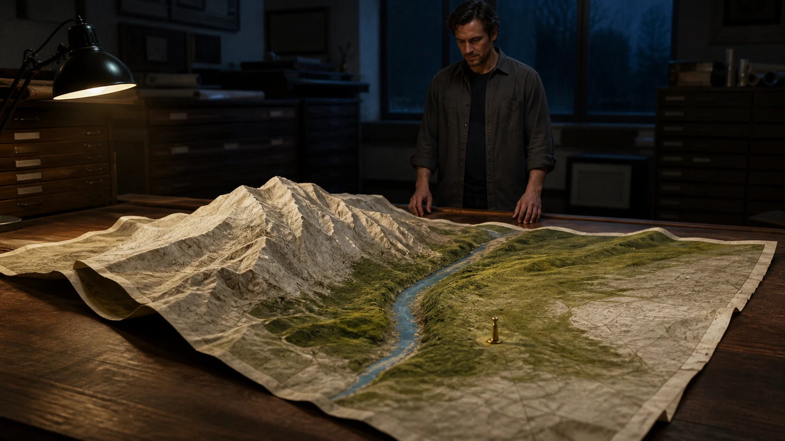

# Surreal Physics and Optical-Illusion Video Prompts

Original MiniMax H3 prompts for practical surrealism, temporal displacement, reflection logic, and controlled material transformation. Each scene defines one impossible rule and keeps ordinary physics stable everywhere else.

## SRL-001 The Map Rises into a Landscape



**Use it for:** A practical-effects transformation where a flat reference becomes a miniature world without losing geography or object count.

**Mode:** First-frame image + terrain detail images + room tone  
**Format:** 16:9, target 15 seconds  
**Reference map:** Image 1 = exact cartographer, archive room, table, map, and opening state; Images 2–4 = paper river, clay ridge, and moss valley material detail only; Audio 1 = archive room tone.

```text
Begin exactly from Image 1. Preserve the adult cartographer's identity, charcoal overshirt, hands, position behind the walnut table, archive drawers, task lamp, one map, one blue river, one pale clay ridge, one moss-green valley, and one brass survey marker. The map is fictional and must never become a real identifiable geography.

0–4 seconds: locked medium-wide shot. The paper along the existing contour lines lifts slowly while the cartographer keeps both hands on the far table edge and watches. 4–9 seconds: the pale ridge rises through practical folds; the blue paper river settles into the same channel already visible in Image 1. The camera lowers slightly to table height but does not cross the map boundary. 9–13 seconds: moss fibers spread only within the existing green valley; the brass marker remains planted and constant in scale. 13–15 seconds: a gentle draft moves the loose map corners; the landscape stops growing and the cartographer exhales once, still not touching it.

Sound intent: Audio 1, paper creases, clay settling, task-lamp hum, no music or dialogue. Keep one continuous transformation, stable room geometry, handcrafted materials, and believable contact shadows. Avoid magical light, floating terrain, new roads or buildings, landslide imagery, changing hands, text, logos, or watermark.
```

**Review:** Start-frame match, terrain topology, material boundaries, person identity, hand position, scale, marker persistence, and restrained audio.

## SRL-002 The Shadow Finishes First

**Use it for:** A subtle temporal illusion in which a character's shadow anticipates one harmless action while the physical room remains unchanged.

**Mode:** Character and workshop references + fixed light diagram + optional room tone  
**Format:** 4:5, target 12 seconds  
**Reference map:** Image 1 = consenting adult bookbinder identity and wardrobe; Image 2 = exact workbench and tools; Image 3 = single-lamp direction and approved shadow shape; Audio 1 = quiet workshop ambience.

```text
Create a vertical practical-surreal scene in a small bookbinding workshop. Preserve the adult bookbinder, navy apron, bench, bone folder, brush, thread spool, blank notebook, lamp position, and hard shadow direction. The only impossible rule is that the bookbinder's shadow performs one action two seconds before the real person; the shadow cannot touch or move physical objects.

0–4 seconds: locked medium shot. The bookbinder aligns the blank notebook at center. Their shadow behaves normally. 4–8 seconds: the shadow's hand reaches toward the bone folder and traces one crease gesture across the shadow of the notebook, while the real person's hands remain still and the real tool does not move. The bookbinder notices and looks at the shadow, not camera. 8–12 seconds: the real person calmly picks up the bone folder and repeats the same crease gesture; the shadow resynchronizes exactly at completion. End on both hands resting beside the notebook.

Sound intent: Audio 1, paper contact during the real action only, one quiet breath, no music or dialogue. Avoid horror behavior, independent shadow anatomy, extra limbs, moved objects during the shadow-only action, changing light direction, readable book text, logos, or watermark.
```

**Review:** Two-second offset, shadow attachment, fixed light, real-object invariants, hand anatomy, reaction subtlety, and clean resynchronization.

## SRL-003 The Puddle Sees the Rain First

**Use it for:** A temporal-reflection effect with a simple cause-and-effect payoff and no dangerous street action.

**Mode:** Location image + consenting adult identity + approved weather states  
**Format:** 9:16, target 12 seconds  
**Reference map:** Image 1 = quiet pedestrian courtyard and exact puddle; Image 2 = adult subject, yellow umbrella, and wardrobe; Images 3–4 = dry and light-rain weather states.

```text
Create a vertical, locked-camera courtyard scene. Preserve the adult subject, folded yellow umbrella, stone paving, bench, doorway, plants, puddle shape, camera, and screen direction. The puddle reflects the same courtyard and person from exactly three seconds in the future; everywhere outside the puddle follows normal time.

0–4 seconds: the courtyard is dry. The subject enters from screen left with the umbrella folded. In the puddle only, their reflected future self has already stopped and opened the umbrella under light rain. 4–8 seconds: the real subject notices the mismatch, stops at the same mark, and looks down. The reflected self remains three seconds ahead and turns slightly toward the doorway. 8–12 seconds: light rain begins in the real courtyard; the subject opens the umbrella with the same movement previously shown in reflection. At the instant the real action catches up, puddle and world resynchronize and remain normal.

Sound intent: dry footsteps, first drops, umbrella click, soft rain, no dialogue or music. Keep reflection geometry, future offset, wardrobe, umbrella mechanics, and rain intensity consistent. Avoid traffic, slipping, storms, duplicate physical people, mirror portals, face changes, text, logos, or watermark.
```

**Review:** Puddle mask, three-second temporal rule, reflection perspective, umbrella continuity, rainfall transition, subject identity, and safe blocking.

## SRL-004 One Sphere, Four Materials

**Use it for:** A multi-reference material transformation where silhouette and motion stay continuous across visibly different physical media.

**Mode:** Four object references + motion path + original sound events  
**Format:** 1:1, target 12 seconds, seamless loop  
**Reference map:** Images 1–4 = exact clear glass, red clay, folded paper, and clear-water sphere appearances; Video 1 = one rights-cleared clockwise rolling path only; Audio 1 = four original material impacts.

```text
Create a square seamless loop with one sphere rolling clockwise around a shallow circular track. Preserve the sphere's diameter, center height, speed, direction, contact point, and track geometry. Transfer only the rolling path from Video 1; do not copy its subject, setting, camera, lighting, or edit design.

0–3 seconds: the sphere is clear glass with correct refraction and a crisp contact shadow. At the first quarter point it passes behind a narrow black post. 3–6 seconds: it emerges as matte red clay, same size and speed, showing slight surface fingerprints but no deformation. At the halfway point it passes through a brief foreground paper strip. 6–9 seconds: it emerges as a folded-paper sphere with stable faceted geometry and no loose pieces. At three quarters it crosses a shallow transparent screen. 9–12 seconds: it emerges as a surface-tension water sphere that retains the same diameter and rolling path, then passes behind the black post and returns to glass for a frame-perfect loop.

Map Audio 1 impacts to each occlusion. Fixed overhead three-quarter camera, neutral studio, no splashes outside the track. Avoid extra spheres, size drift, teleporting, backward motion, mixed materials between transitions, impossible reflections, text, logos, or watermark.
```

**Review:** One-sphere identity, diameter, speed, occlusion logic, material fidelity, contact physics, sound mapping, and loop seam.
